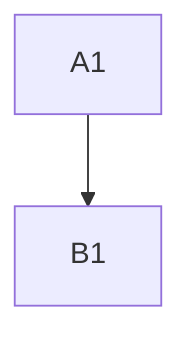
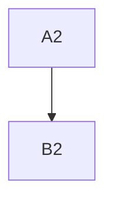

###  Trailing Blanks

PROBLEM: versions before 23feb15 do not recognize diagrams when the word mermaid is followed by Trailing space. Yet trailing is an allowed MD practice.
 - whitespace located at the end of a line, without any other characters following it.

TEST: npx -p @mermaid-js/mermaid-cli  mmdc -i md-TrailingBlanks.md -o /tmp/output-svg.md
Found 1 mermaid charts in Markdown input  ===> SHOULD BE 2
 ✅ ./output-svg-1.svg
 ✅ /tmp/output-svg.md

### This undetected diagram before 2023feb15 due to trailling spaces

next line has trailing spaces after the word mermaid:

### This detected diagram has no trailing blanks after mermaid

no spaces after the word mermaid

