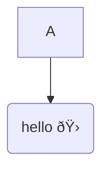
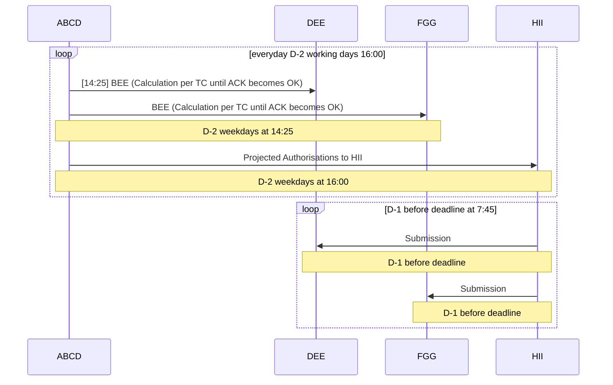
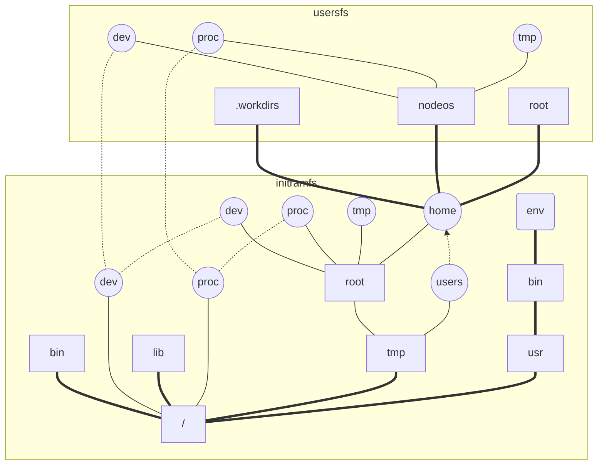
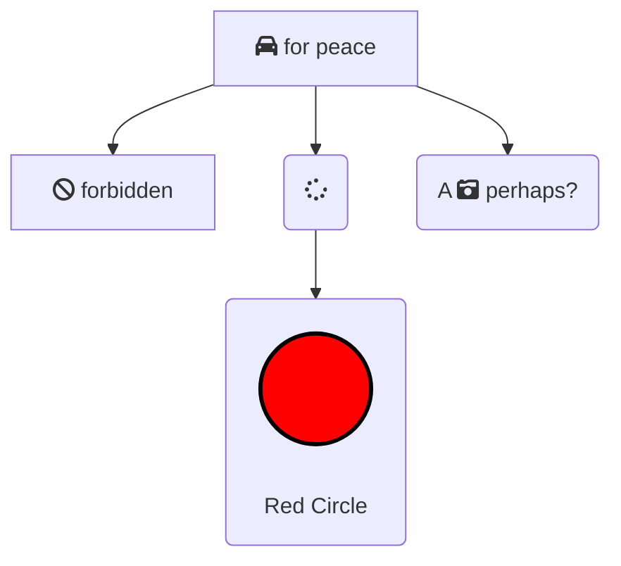
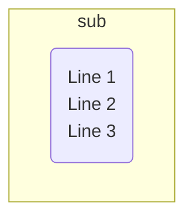
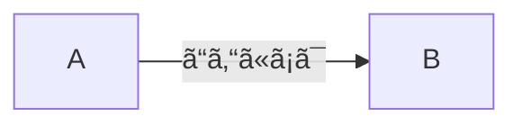
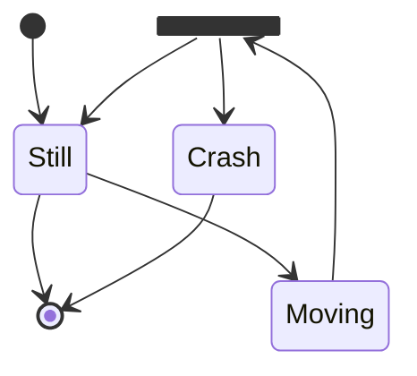

1. emojis.mmd

```mermaid
graph TD
A-->B("hello ðŸ›")
```
2. flowchart1.mmd

```mermaid
sequenceDiagram
%% See https://mermaidjs.github.io/sequenceDiagram.html

loop everyday D-2 working days 16:00
    ABCD->>DEE: [14:25] BEE (Calculation per TC until ACK becomes OK)
    
    ABCD->>FGG: BEE (Calculation per TC until ACK becomes OK)
    Note over ABCD,FGG: D-2 weekdays at 14:25
    ABCD->>HII: Projected Authorisations to HII
    Note over ABCD,HII: D-2 weekdays at 16:00
end

loop D-1 before deadline at 7:45
    HII->>DEE: Submission
    Note over HII,DEE: D-1 before deadline
    HII->>FGG: Submission
    Note over HII,FGG: D-1 before deadline
end
```
3. flowchart2.mmd

```mermaid
graph BT
  subgraph initramfs
    / === ibin[bin]
    / --- DEV((dev))
    / === ilib[lib]
    / --- proc((proc))
    / === tmp

    /   === usr
    usr === bin
    bin === ENV(env)

    tmp --- root
    tmp --- users((users))

    root --- RDEV((dev))
    root --- rproc((proc))
    root --- rtmp((tmp))

    root --- home((home))
  end

  subgraph usersfs
    .workdirs
    nodeos
    uroot[root]

    nodeos --- NDEV((dev))
    nodeos --- nproc((proc))
    nodeos --- ntmp((tmp))
  end

  home === .workdirs
  home === nodeos
  home === uroot

  users -.-> home

  DEV  -.- NDEV
  proc -.- nproc

  DEV  -.- RDEV
  proc -.- rproc
```
4. flowchart3.mmd

```mermaid
graph TD
    B["fa:fa-car for peace"]
    B-->C[fa:fa-ban forbidden]
    B-->D(fa:fa-spinner);
    B-->E(A fa:fa-camera-retro perhaps?);
    %% Test whether embed <img> work correctly
    D-->F("<img height='100' width='100' src='data:image/svg+xml,%3Csvg xmlns=%22http://www.w3.org/2000/svg%22%3E%3Ccircle cx=%2250%22 cy=%2250%22 r=%2240%22 stroke=%22black%22 stroke-width=%223%22 fill=%22red%22 /%3E%3C/svg%3E'/> <br/> Red Circle")
```
5. graph-with-br.mmd

```mermaid
graph TD
  subgraph sub
    node(Line 1<br>Line 2<br/>Line 3)
  end
```
6. japanese-chars.mmd

```mermaid
graph LR
    A -->|ã“ã‚“ã«ã¡ã¯| B
```
7. sequence.mmd

```mermaid
sequenceDiagram
%% See https://mermaidjs.github.io/sequenceDiagram.html

loop everyday D-2 working days 16:00
    ABCD->>DEE: [14:25] BEE (Calculation per TC until ACK becomes OK)
    
    ABCD->>FGG: BEE (Calculation per TC until ACK becomes OK)
    Note over ABCD,FGG: D-2 weekdays at 14:25
    ABCD->>HII: Projected Authorisations to HII
    Note over ABCD,HII: D-2 weekdays at 16:00
end

loop D-1 before deadline at 7:45
    HII->>DEE: Submission
    Note over HII,DEE: D-1 before deadline
    HII->>FGG: Submission
    Note over HII,FGG: D-1 before deadline
end
```
8. state1.mmd

```mermaid
stateDiagram
    state Choose <<fork>>
    [*] --> Still
    Still --> [*]

    Still --> Moving
    Moving --> Choose
    Choose --> Still
    Choose --> Crash
    Crash --> [*]
```
9. state2.mmd

```mermaid
stateDiagram
    state Choose <<fork>>
    [*] --> Still
    Still --> [*]

    Still --> Moving
    Moving --> Choose
    Choose --> Still
    Choose --> Crash
    Crash --> [*]
```