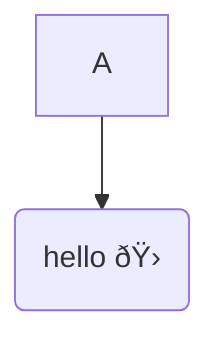
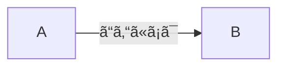

1. emojis.mmd

2. git-graph.mmd

3. flowchart2.mmd

4. flowchart3.mmd

5. graph-with-br.mmd

6. japanese-chars.mmd

7. sequence.mmd

There should be an empty newline after this line, but before the Mermaid diagram:


8. Should still find mermaid code even when code-block is indented.

    ```mermaid
    stateDiagram
        accTitle: State diagram example with \"double-quotes"
        accDescr: State diagram describing movement states and containing [] square brackets and \[]

        state Choose <<fork>>
        [*] --> Still
        Still --> [*]

        Still --> Moving
        Moving --> Choose
        Choose --> Still
        Choose --> Crash
        Crash --> [*]
    ```

9. Should still find mermaid code even with trailing spaces after the opening
`` ```mermaid `` and closing `` ``` ``.


**Warning**: do not delete the trailing spaces after the \`\`\`

10. Flowchart with KaTeX in it


11. Flowchart using Elk and handDrawn look


