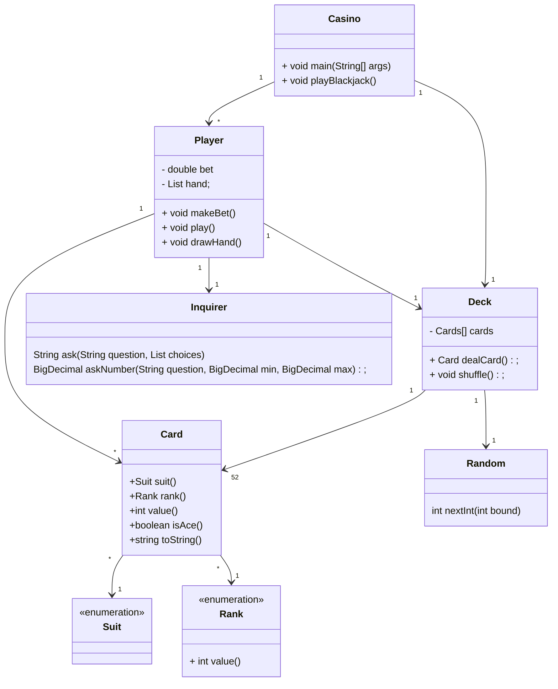
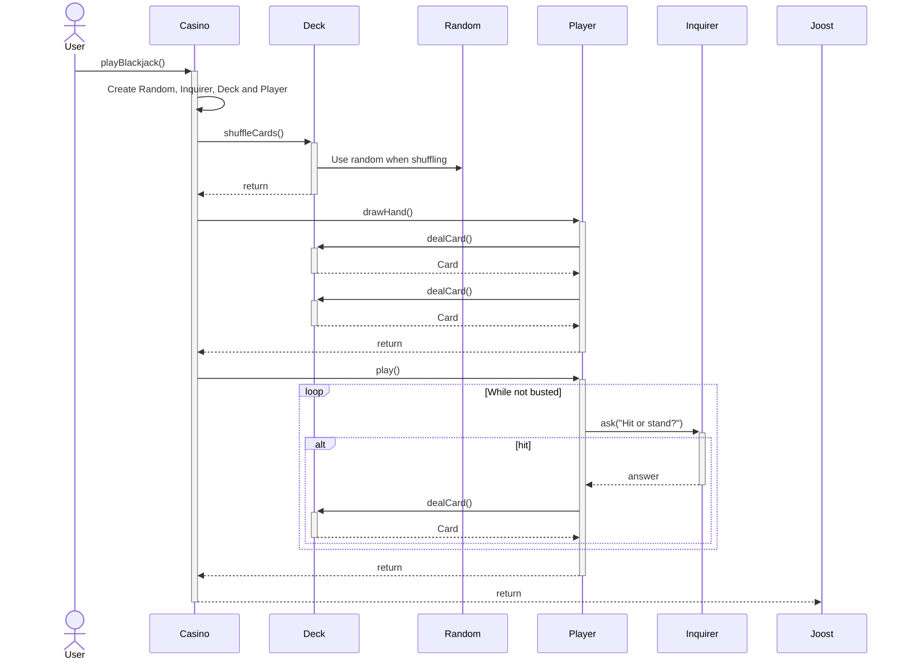

# Blackjack

## Class diagram

```mermaid
 classDiagram
      Card "*" --> "1" Suit
      Card "*" --> "1" Rank
      Player "1" --> "*" Card
      Deck "1" --> "1" Random
      Deck "1" --> "52" Card
      Player "1" --> "1" Inquirer
      Player "1" --> "1" Deck
      Casino "1" --> "*" Player
      Casino "1" --> "1" Deck
      class Casino {
          + void main(String[] args)
          + void playBlackjack()
      }
      class Suit {
       <<enumeration>>
      }
      class Rank {
       <<enumeration>>
       + int value()
       }
      class Inquirer {
          String ask(String question, List<String> choices)
          BigDecimal askNumber(String question, BigDecimal min, BigDecimal max);
      }
      class Random {
          int nextInt(int bound)
      }
      class Player {
          - double bet
          - List<Card> hand;
          + void makeBet()
          + void play()
          + void drawHand()
      }
      class Deck {
          - Cards[] cards
          + Card dealCard();
          + void shuffle();
      }
      class Card {
          +Suit suit()
          +Rank rank()
          +int value()
          +boolean isAce()
          +string toString()
      }
```

## Sequence diagram

```mermaid
sequenceDiagram
    actor User
    User->>+Casino: playBlackjack()
    Casino->>Casino: Create Random, Inquirer, Deck and Player
    Casino->>+Deck: shuffleCards()
    Deck->>Random: Use random when shuffling
    Deck-->>-Casino: return
    Casino->>+Player: drawHand()
    Player->>+Deck: dealCard()
    Deck-->>-Player: Card
    Player->>+Deck: dealCard()
    Deck-->>-Player: Card
    Player-->>-Casino: return
    Casino->>+Player: play()
    loop While not busted
      Player->>+Inquirer: ask("Hit or stand?")
      alt hit
      Inquirer-->>-Player: answer
      Player->>+Deck: dealCard()
      Deck-->>-Player: Card
      end
    end
    Player-->>-Casino: return
    Casino-->>-Joost: return
```
